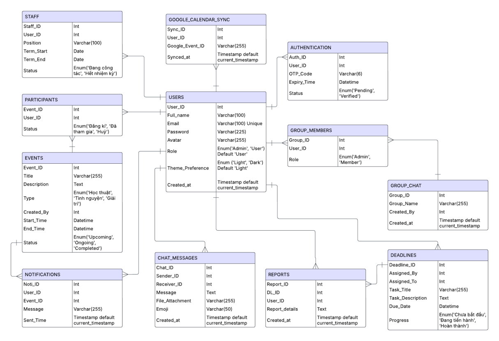

# NT106.P22.ANTT - LẬP TRÌNH MẠNG CĂN BẢN

_**Lời ngỏ:**_
_Chào mừng quý thầy cô và các bạn đến với ứng dụng đầu tiên của nhóm 4! Đây là sản phẩm mà cả nhóm đã cùng nhau lên ý tưởng, xây dựng và hoàn thiện với tất cả sự tâm huyết. Chúng mình hy vọng rằng ứng dụng này sẽ mang lại những trải nghiệm hữu ích và thú vị cho mọi người._
_Dù đã cố gắng hết sức, nhưng chắc chắn không thể tránh khỏi những thiếu sót. Nhóm rất mong nhận được những góp ý chân thành từ quý thầy cô và các bạn để có thể cải thiện và phát triển sản phẩm ngày càng tốt hơn. Sự ủng hộ và đóng góp của mọi người chính là động lực lớn nhất để nhóm tiếp tục học hỏi và hoàn thiện hơn trong những dự án tiếp theo._
_Một lần nữa, nhóm 4 xin chân thành cảm ơn! ❤️_

# I. ĐỒ ÁN MÔN HỌC

**Tên đề tài:** Hệ thống phát triển và quản lý dịch vụ Đoàn khoa Mạng máy tính và Truyền thông.

# II. DANH SÁCH THÀNH VIÊN

1. Nguyễn Đình Khang - **MSSV:** 23520694
2. Hoàng Bảo Phước - **MSSV:** 23521231
3. Đỗ Quang Trung - **MSSV:** 23521673

# III. GIỚI THIỆU VỀ ỨNG DỤNG

## 📋 Tổng quan
Hệ thống quản lý hoạt động thanh niên là một ứng dụng desktop được phát triển bằng WPF (.NET) và ASP.NET Core Web API, hỗ trợ quản lý các hoạt động, thành viên và giao tiếp trong tổ chức Đoàn khoa.

## 🏗️ Kiến trúc hệ thống

### Client-Server Architecture
- **Frontend**: WPF Application (.NET Framework/Core)
- **Backend**: ASP.NET Core Web API
- **Database**: MongoDB
- **Real-time Communication**: SignalR

### Database Schema


# IV. CẤU TRÚC THƯ MỤC

```
Youth-Activities-Management-System-Project/
├── DoanKhoaClient/              # WPF Client Application
│   ├── Models/                  # Data models
│   ├── ViewModels/             # MVVM ViewModels
│   ├── Views/                  # WPF Views/Windows
│   ├── Services/               # API communication services
│   ├── Helpers/                # Utility classes
│   ├── Resources/              # UI resources & themes
│   └── Properties/             # Application settings
├── DoanKhoaServer/             # ASP.NET Core Web API
│   ├── Controllers/            # API controllers
│   ├── Models/                 # Data models
│   ├── Services/               # Business logic services
│   ├── Hubs/                   # SignalR hubs
│   ├── Settings/               # Configuration settings
│   └── Uploads/                # File upload storage
└── DEBUG_CHAT.md               # Development notes
```

# V. TÍNH NĂNG CHÍNH

## 🔐 Hệ thống xác thực & phân quyền
- **Đăng ký/Đăng nhập**: Hỗ trợ 2FA với OTP qua email
- **Phân quyền**: User và Admin với các quyền khác nhau
- **Quản lý phiên**: Session management với remember login
- **Bảo mật**: JWT token authentication

## 👥 Quản lý thành viên (Admin)
- Xem danh sách thành viên với tìm kiếm và lọc
- Thêm/sửa/xóa thành viên
- Chỉnh sửa hàng loạt (batch operations)
- Đặt lại mật khẩu cho thành viên
- Xem chi tiết thông tin thành viên

## 🎯 Quản lý hoạt động
### Cho Admin:
- Tạo/sửa/xóa hoạt động
- Quản lý các loại hoạt động: Academic, Volunteer, Entertainment
- Theo dõi trạng thái: Upcoming, Ongoing, Completed
- Xem thống kê tham gia và lượt thích

### Cho User:
- Xem danh sách hoạt động với bộ lọc
- Thích/bỏ thích hoạt động
- Xem chi tiết hoạt động
- Bình luận và trả lời bình luận

## 💬 Hệ thống chat real-time
- Chat cá nhân và nhóm
- Gửi tin nhắn văn bản, hình ảnh, file đính kèm
- Hiển thị trạng thái online/offline
- Tải xuống file đính kèm
- Giao diện khác biệt cho Admin và User

## 📋 Quản lý công việc (Task Management)
### Cấu trúc phân cấp:
- **Task Sessions**: Phiên làm việc (Event, Study, Design)
- **Task Programs**: Chương trình trong phiên
- **Task Items**: Công việc cụ thể trong chương trình

### Tính năng:
- Tạo và quản lý các phiên làm việc
- Phân loại theo loại: Event, Study, Design
- Theo dõi tiến độ và trạng thái
- Phân công nhiệm vụ cho thành viên

## 🎨 Giao diện người dùng
- **Theme**: Hỗ trợ Light/Dark mode
- **Responsive**: Giao diện thích ứng
- **MVVM Pattern**: Kiến trúc rõ ràng, dễ bảo trì
- **Material Design**: Giao diện hiện đại, thân thiện

# VI. CÔNG NGHỆ SỬ DỤNG

## Frontend (DoanKhoaClient)
- **Framework**: WPF (.NET)
- **Pattern**: MVVM (Model-View-ViewModel)
- **UI Controls**: Custom controls với Material Design
- **HTTP Client**: HttpClient cho API calls
- **Real-time**: SignalR Client

## Backend (DoanKhoaServer)
- **Framework**: ASP.NET Core Web API
- **Database**: MongoDB với MongoDB.Driver
- **Authentication**: JWT tokens
- **Real-time**: SignalR
- **File Upload**: Multipart form data handling
- **Email**: SMTP service cho OTP

## Packages chính
```xml
<!-- Client -->
<PackageReference Include="Microsoft.AspNet.SignalR.Client" />
<PackageReference Include="Newtonsoft.Json" />

<!-- Server -->
<PackageReference Include="MongoDB.Driver" />
<PackageReference Include="Microsoft.AspNetCore.SignalR" />
<PackageReference Include="System.IdentityModel.Tokens.Jwt" />
```

# VII. HƯỚNG DẪN CÀI ĐẶT

## Yêu cầu hệ thống
- .NET Framework 4.7.2+ hoặc .NET 6.0+
- MongoDB 4.4+
- Visual Studio 2019+ hoặc VS Code

## Bước 1: Clone repository
```bash
git clone <repository-url>
cd Youth-Activities-Management-System-Project
```

## Bước 2: Cấu hình Database
1. Cài đặt MongoDB
2. Tạo database `YouthActivitiesDB`
3. Cập nhật connection string trong `appsettings.json`

## Bước 3: Chạy Server
```bash
cd DoanKhoaServer
dotnet restore
dotnet run
```
Server sẽ chạy tại: `http://localhost:5299`

## Bước 4: Chạy Client
1. Mở `DoanKhoaClient.sln` trong Visual Studio
2. Build và chạy project

## Bước 5: Tài khoản mặc định
- **Admin**: username/password (cần mã admin code)
- **User**: Đăng ký tài khoản mới

# VIII. API ENDPOINTS

## Authentication
- `POST /api/auth/register` - Đăng ký tài khoản
- `POST /api/auth/login` - Đăng nhập
- `POST /api/auth/verify-otp` - Xác thực OTP

## Users
- `GET /api/users` - Lấy danh sách users (Admin)
- `POST /api/users` - Tạo user mới (Admin)
- `PUT /api/users/{id}` - Cập nhật user (Admin)
- `DELETE /api/users/{id}` - Xóa user (Admin)

## Activities
- `GET /api/activities` - Lấy danh sách hoạt động
- `POST /api/activities` - Tạo hoạt động mới (Admin)
- `PUT /api/activities/{id}` - Cập nhật hoạt động (Admin)
- `DELETE /api/activities/{id}` - Xóa hoạt động (Admin)
- `POST /api/activities/{id}/like` - Thích/bỏ thích hoạt động

## Comments
- `GET /api/comments/activity/{id}` - Lấy bình luận của hoạt động
- `POST /api/comments` - Thêm bình luận mới
- `PUT /api/comments/{id}` - Cập nhật bình luận
- `DELETE /api/comments/{id}` - Xóa bình luận

## Tasks
- `GET /api/tasks/sessions` - Lấy danh sách phiên làm việc
- `POST /api/tasks/sessions` - Tạo phiên làm việc mới
- `GET /api/tasks/programs` - Lấy danh sách chương trình
- `POST /api/tasks/programs` - Tạo chương trình mới

# IX. TÍNH NĂNG NỔI BẬT

## 🚀 Real-time Communication
- Chat trực tiếp với SignalR
- Cập nhật trạng thái online/offline
- Thông báo real-time cho hoạt động mới

## 🔒 Bảo mật cao
- Mã hóa mật khẩu
- JWT token với expiration
- 2FA authentication
- Role-based access control

## 📱 User Experience
- Giao diện trực quan, dễ sử dụng
- Theme switching (Light/Dark)
- Responsive design
- Error handling comprehensive

## 🔧 Kiến trúc mở rộng
- MVVM pattern cho maintainability
- Service-oriented architecture
- Dependency injection
- Clean code practices

# X. HƯỚNG PHÁT TRIỂN

## Tính năng có thể thêm
- [ ] Mobile app (Xamarin/MAUI)
- [ ] Push notifications
- [ ] Calendar integration
- [ ] File sharing system
- [ ] Video call integration
- [ ] Advanced analytics dashboard
- [ ] Export/Import functionality

## Cải tiến kỹ thuật
- [ ] Microservices architecture
- [ ] Redis caching
- [ ] Docker containerization
- [ ] CI/CD pipeline
- [ ] Unit testing coverage
- [ ] Performance optimization

# XI. TROUBLESHOOTING

## Lỗi thường gặp

### 1. Không kết nối được database
```
Kiểm tra MongoDB service đang chạy
Xác nhận connection string đúng
Kiểm tra firewall settings
```

### 2. SignalR connection failed
```
Đảm bảo server đang chạy
Kiểm tra CORS settings
Xác nhận port không bị chặn
```

### 3. File upload không thành công
```
Kiểm tra thư mục Uploads có quyền ghi
Xác nhận file size không quá giới hạn
Kiểm tra file type được support
```

# XII. LIÊN HỆ & HỖ TRỢ

Nếu có thắc mắc hoặc cần hỗ trợ, vui lòng liên hệ:

- **Nguyễn Đình Khang** - MSSV: 23520694
- **Hoàng Bảo Phước** - MSSV: 23521231  
- **Đỗ Quang Trung** - MSSV: 23521673

---

_Cảm ơn bạn đã quan tâm đến dự án của chúng tôi! 🎉_
